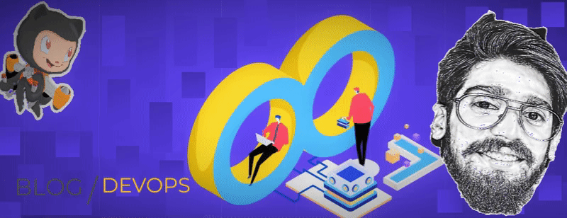

  
# Hey there! 👋 I'm Arjun Manoj Kumar

### 🚀 Building Scalable Cloud Infrastructure

**Kozhikode-based · UAE-bred · Fueled by strong coffee and curiosity for tech**

---

## 👨‍💻 About Me

DevOps Engineer with **5+ years** crafting resilient, automated infrastructure across **AWS, Azure, and GCP**. I specialize in building bridges between development and operations, automating complex workflows, and managing multi-cloud environments.

| 🏆 5+ Years Experience | ⚡ 15% Deployment Time Reduction | 🎯 99% Uptime Achieved | 👥 2000+ Clients Served |
|:---:|:---:|:---:|:---:|

- 🔭 Currently working at **Abilytics, Kochi** as DevOps Engineer
- 🌍 Experienced with clients: **Western Union, Nuvineer, Nutanix, Sarto**
- 🎓 B.Tech in Electronics & Communication from **Model Engineering College**
- 🔧 Diploma in Mechatronics from **NTTF**
- 📍 Based in **Kozhikode, Kerala, India**

---

## 🛠️ Tech Stack

### ☁️ Cloud Platforms

### 🏗️ Infrastructure as Code

### 🚀 CI/CD & Automation

### 🐳 Containers & Orchestration

### 🔧 Tools & Monitoring

### 💾 Databases

---

## 💼 Career Journey

### 🏢 DevOps Engineer @ Abilytics, Kochi
**June 2022 — Present**
- 🔹 **Western Union:** Designed AWS infrastructure using Terraform (ECS, API Gateway, Lambda)
- 🔹 **Nuvineer:** Architected full GCP solution with Cloud Run, Cloud SQL, and Auth Proxy — replicated on AWS for multi-cloud
- 🔹 **Nutanix:** Managed Kubernetes clusters and Jenkins CI/CD pipelines
- 🔹 **Sarto:** Implemented AWS CodePipeline and CodeDeploy automation
- 🔹 Developed AI-based web app for automated infrastructure architecture generation

### 🏥 DevOps Engineer @ CareStack, Thiruvananthapuram
**June 2021 — Jan 2022**
- SaaS dental management platform serving 2000+ clients
- Led Account Deletion Tool project — automated Azure, MySQL, SMTP, Plivo, and GoDaddy processes
- Maintained 99% uptime for critical production servers
- 🏆 **Reduced infrastructure decommissioning time by 15%**

### ☁️ System Engineer @ MegArcus (Remote)
**August 2020 — May 2021**
- Pioneered Omnichannel chat service using AWS Connect, EC2, SNS, and Lex
- Hosted Magento 2 eCommerce on AWS EC2 with LAMP stack and CloudFront CDN

---

## 🚀 Featured Projects

| Project | Description | Tech Stack |
|---------|-------------|------------|
| 🎓 **[Course Creator](https://coursecreator.mkarjun.com/)** | AI-powered learning platform with curated YouTube videos, quizzes & achievements | AI/ML, Google OAuth, YouTube API |
| 🏠 **Home Server Lab** | 24/7 Ubuntu server running 7 Docker containers for personal infrastructure | Docker, Jellyfin, Home Assistant, n8n, Grafana, Pi-hole |
| ⚡ **Smart Metering System** | IoT system for real-time utility monitoring via web dashboard | IoT, Sensors, Real-time Data |
| 🤖 **[Personal Assistant Robot](https://www.youtube.com/watch?v=Mkc4fw-3o4I)** | Assistive robot controlled via hand gestures for disabled individuals | Robotics, Arduino, Gesture Control |

---

## 📝 Latest Articles

- 📘 [DeepSeek Unleashed – Part 2: The Core](https://abilytics.com/deepseek-unleashed-part-2-the-core/) - Run DeepSeek locally with Ollama
- 📗 [DeepSeek Unleashed – Part 1: From Bedrock to Control](https://content.mkarjun.com/deepseek-from-bedrock-to-control) - Running DeepSeek on AWS Bedrock
- 📙 [The Future of Platform Engineering 2025](https://content.mkarjun.com/the-future-of-platform-engineering-2025) - Trends and predictions
- 📕 [Elevate Your Container Game with Finch](https://content.mkarjun.com/elevate-your-container-game-simplifying-container-development-with-finch) - Docker alternative

➡️ **[View All Articles](https://content.mkarjun.com/)**

---

## 🎤 Speaking & Publications

### 🔜 Upcoming Presentation @ ICAIEI 2026
**International Conference on AI & Emerging Technologies**

📄 *"Small Language Models for Industrial Security: Log Analysis and Incident Response in Production Environments"*

**February 22, 2026** | `SLM` `Security` `Log Analysis` `Incident Response`

---

## 📊 GitHub Stats

<!-- GitHub Trophies -->

  

<!-- GitHub Stats Card - Using alternative instance -->

&nbsp;&nbsp;
<!-- Top Languages Card -->

  

<!-- GitHub Streak Stats -->

  

<!-- Activity Graph -->

---

## 🤝 Let's Connect!

 

---

**💡 Open to Opportunities | Let's Build Something Amazing Together!**

*Designed & Built with ❤️ by Arjun Manoj Kumar*

